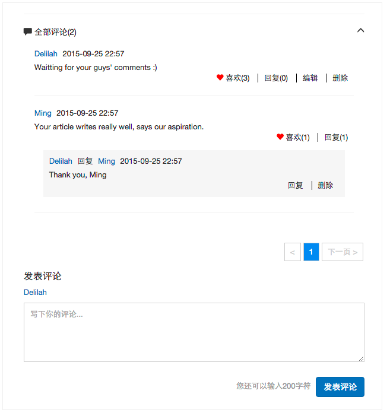

留言板
================

这是一个留言板 JS 插件；

### 功能

- 涉及的交互： 新增，编辑、删除、回复、点赞
- 分页（但服务端逻辑没写完）

### 涉及技术点

- 面向对象编程
- HTML 模版
- Bootstrap
- Express
- Bourne : 模拟数据库
- RESTful API
- 接口设计：https://github.com/heydelilah/JSPlugins/blob/master/comments/docs/data_structure.md

### 备注：

- 由于习惯了字段是大写开头，但又想使用bourne里的自增id，因此替换了'id'。即`npm install bourne` 后，还要手动把'.id'全部替换成'.Id'才能用
- 分页功能后端部分没做，毕竟 Bourne.js 不是真正的数据库，做起过滤数据来很麻烦。 #todo: 把 Bourne 改为 Mongodb#
- 评论的层级只保留两级，即不无限嵌套评论，因为那样感觉很累赘；
- 关于“当前登陆用户”，暂时是分别写死了在前后端；#todo#

### RUN

	npm install
	bower install
	node server.js
	访问： http://localhost:3000/

### TODO

- HTML 要优化，命名和布局都不好。[紧急]
- 添加前端 Unit Test
- Unit Test 时使用 Mockjs，try 拦截ajax
- 代码优化，使用 Requirejs 做模块化；
- 补齐“分页模块”的后端逻辑
	- 按日期排序
	- 取前20条返回
- 新增“取消点赞”功能
- 为了方便测试交互效果，新增功能: 1. 切换用户；2. 切换文章；3. 新增文章；

### 资料

- [阮一峰: RESTful API 设计指南](http://www.ruanyifeng.com/blog/2014/05/restful_api.html)
- [Andrew: bourne](https://github.com/andrew8088/bourne)

### 截图

