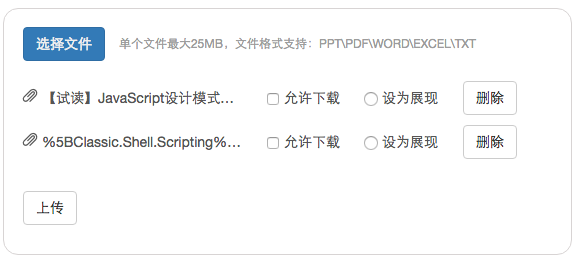

# 文件上传

- 面向对象；动态构建；
- 文件大小格式检查
- 使用 FormData;
- Bootstrap 样式
- Express 服务端；

#### 遇到的坑：

在file对象中自定义的属性，将不会被服务端读取到。跟序列化有关？

#### RUN:

	npm install
	node server.js
	访问：http://localhost:3000/main.html

#### 关于文件上传

- input: 原始原生方式
- iframe: 以达到可异步的效果
- FormData + AJAX
- FileReader 对象: HTML5 新的File AP (#TO LEARN#)

## JS: 使用 FormData 对象上传文件

1. 创建 FormData 对象

		var fd = new FormData();

2. 使用 `append()` 方法，向 FormData 对象添加字段

		fd.append("files", files);

3. 使用 jquery 封装的 ajax 时候，要设置 `processData`, `contentType` 属性为 false

		$.ajax({
			url: "/upload",
			type: "POST",
			data: fd,
			processData: false,  // 告诉jQuery不要去处理发送的数据
			contentType: false   // 告诉jQuery不要去设置Content-Type请求头
		});

## Express: 使用 multer 中间件，解析文件

1. 安装

		$ npm install --save multer

2. 引用

		var multer  = require('multer')

3. 初始化

		var upload = multer({ dest: 'cache_files/' })
dest: 为上传的文件储存的目录，不设置的话，就只会存在内存中

4. 使用

		app.post('/upload', upload.array('files', 12), function (req, res, next) {
			// req.files is array of `photos` files
			// req.body will contain the text fields, if there were any
		})

## 相关资源：

1. [Github: expressjs 的中间件 multer](https://github.com/expressjs/multer)
2. [MDN: 使用FormData对象发送文件](https://developer.mozilla.org/zh-CN/docs/Web/Guide/Using_FormData_Objects#.E4.BD.BF.E7.94.A8FormData.E5.AF.B9.E8.B1.A1.E5.8F.91.E9.80.81.E6.96.87.E4.BB.B6
)
3. [MDN: 如何在web应用程序中使用文件](https://developer.mozilla.org/zh-CN/docs/Using_files_from_web_applications)
4. [阮一峰: 文件上传的渐进式增强](http://www.ruanyifeng.com/blog/2012/08/file_upload.html)

@20151002